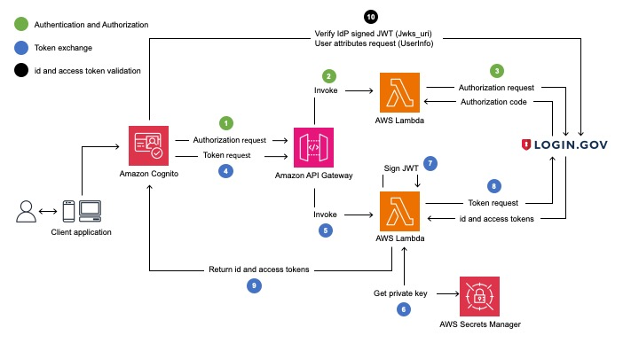
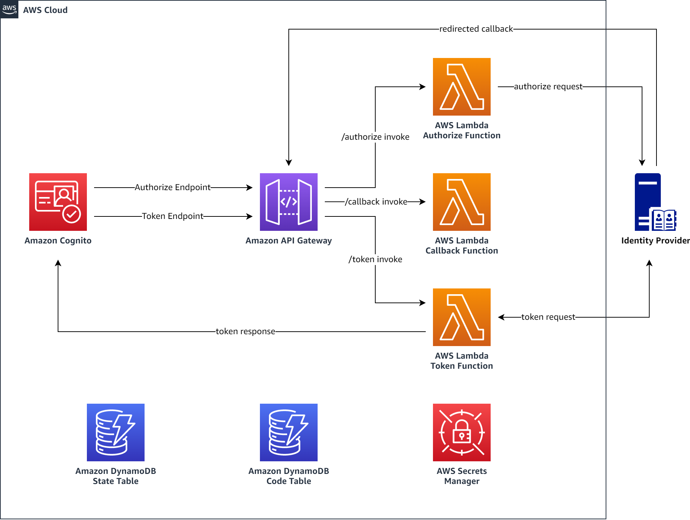

<<<<<<< HEAD
## My Project

TODO: Fill this README out!

Be sure to:

* Change the title in this README
* Edit your repository description on GitHub

## Security

See [CONTRIBUTING](CONTRIBUTING.md#security-issue-notifications) for more information.

## License

This library is licensed under the MIT-0 License. See the LICENSE file.

=======
# Example proxy between Amazon Cognito and a 3rd party OIDC IdP with custom authorization parameters
This sample shows how to deploy a proxy between an Amazon Cognito User Pool and a 3rd party OIDC identity provider (IdP) with custom parameters required for authorization. 3rd party IdPs, such as [Login.gov](https://login.gov/), supports private_key_jwt as the authentication method for clients who want to federate to Login.gov using OIDC and requires certain parameters to be passed to the authorization endpoint. This sample specifically focuses on three use-cases to authenticate clients:
* pass custom parameters to authorization endpoint
* use a private key JWT instead of a client secret for client authentication
* (optional) leverage a Proof Key for Code Exchange (PKCE), which extends the authentication code flow

NOTE: The sample code provided is for demonstration purposes and should not be used directly for production use cases as-is without additional testing and review.

## What this repository contains
This repository contains the sample code for the building blocks for all communication between a Cognito User Pool and a 3rd party OIDC IdP (e.g., Login.gov) to add custom authorization parameters, Private Key JWT, and PKCE (optional) functionality. The main components are defined as:
* Lambda Function code in Python for handling authorize, callback (PKCE only) and token requests in the [lambda directory](lambda/)
* two [CDK stacks](cdk/) - one with PKCE, one without. You can toggle the use of PKCE in the context file (see "Deployment" section)

## What this repository does not contain
This repository does not contain a front-end application to integrate with the Cognito User Pool. The provisioned resources work without any frontend application but if you want to use it in an end-to-end example, you can:
* use your existing application - just retrieve the User Pool details from the console or the CLI after you deployed the stack and configure your own application accordingly
* see [this repo](https://github.com/aws-samples/amazon-cognito-authentication-sample-react-app) for a single page application with React and Cognito.

## Architecture overview without PKCE


## Architecture overview with PKCE


## Additional resources
* [Using Login.gov as an OIDC IdP with Amazon Cognito user pools blog post](https://aws.amazon.com/blogs/publicsector/using-login-gov-as-an-oidc-idp-with-amazon-cognito-user-pools/) 
* [Use private key JWT authentication between Amazon Cognito user pools and an OIDC IdP blog post](https://aws.amazon.com/blogs/security/use-private-key-jwt-authentication-between-amazon-cognito-user-pools-and-an-oidc-idp/) for a high-level overview of the concept and use-case
* [detailed request flow for private key JWT](docs/DETAILED_FLOW_WITHOUT_PKCE.md) and
* [detailed request flow for private key JWT and PKCE](docs/DETAILED_FLOW_WITH_PKCE.md) for more insights into the request flow

# Setup and Deployment

## Setup your local environment

This project uses Python 3.10 with virtualenv.

First, from the root of this repo, create a virtualenv:

```
$ python -m venv .venv
```

After the virtualenv is created, you can use the following step to activate your virtualenv.

```
$ source .venv/bin/activate
```

Once the virtualenv is activated, you can install the required dependencies.

```
(.venv) $ pip install -r requirements.txt
```

## Deploy the stack

### Requirements
* use CDK 2.76+ - [how to install CDK](https://docs.aws.amazon.com/cdk/v2/guide/getting_started.html#getting_started_install)
* set up your local environment (see above)
* set up your external IdP - [here is an example of Login.gov OIDC](https://developers.login.gov/oidc/getting-started/)
* have an AWS account ready with sufficient permissions to deploy the resources of the stack

### Deployment

Copy the `cdk.context.template` file to a new file called `cdk.context.json` and fill in the required information from your external IdP configurations. This holds all configuration items necessary for integrating Cognito with your external OIDC IdP through the proxy.

Note: PKCE is set to "false" by default. Make sure to set it to true, if you need it.
```
(.venv) $ cp cdk.context.template cdk.context.json
```

Install the required layer files before deployment. The Lambda function to handle token requests has a 3rd party python library dependency, which requires this layer.
```
(.venv) $ pip install -r ./lambda/token/requirements.txt --target ./layers/token/python --only-binary=":all:" --platform manylinux2014_x86_64
```

After setting all parameters in `cdk.context.json` and installing the layer files, you can go on and deploy the stack
```
(.venv) $ cdk deploy
```
or if you use a aws cli profile:
```
(.venv) $ cdk deploy --profile YOURPROFILE
```

After successful deployment, retrieve `ApiGwCallbackEndpoint` (if you use PKCE) and the `CognitoIdpResponseUri` from the output section and share them as allowed redirect / callback URLs in your IdPs application configuration.

# Managing keys for Private Key JWT functionality

## Create a private / public key pair in JWK format
You have three options to generate a key pair for this sample:
1. OPTION: Some identity providers allow you to create a private / public key pair when configuring the application. E.g. for [Login.gov, see "Creating a public certificate"](https://developers.login.gov/testing/#creating-a-public-certificate)

2. OPTION: You can create a key pair with the `generate-keys.py` script in the `scripts` folder of this repo (make sure to have installed all dependencies from the `requirements.txt`)
```
(.venv) $ python ./scripts/generate-keys.py
```
This creates two json files in `./local`: `private-key.json` and the derived `public-key.json`.

3. OPTION: Create your own private / public key pair and convert it to JWK format with a library or cli tool of your choice. The generated private key should look like this:
```
{
	"d":"Mz3EZSSe...",
	"dp":"FIZyTNP9...",
	"dq":"wUSOQSYb...",
	"e":"AQAB",
	"kid":"5e5354ac-...",
	"kty":"RSA",
	"n":"dx-0HVhw...",
	"p":"kSAg-2HF...",
	"q":"tZL8Z7Uy-...",
	"qi":"ZCTDhS6s..."
}
```

## Upload the private key to Secrets Manager
The stack deploys an empty secret in Secrets Manager that you need to populate with your private key. Retrieve the ARN of the empty secret in AWS Secrets Manager from the CDK or CloudFormation Stack output section:


With that, upload the key - if you used the script to generate the key pair, run the following command with the correct ARN. Make sure to specify the AWS CLI profile if you use one by adding `--profile YOURPROFILE`:
```
$ SECRET_ARN=YOURSECRETARN

$ aws secretsmanager put-secret-value \
--secret-id $SECRET_ARN \
--secret-string file://./local/private_key.json
```
If you used another option, either point the `--secret-string file://...` to where you stored the private key or paste your private key in-line:
```
$ SECRET_ARN=YOURSECRETARN

$ aws secretsmanager put-secret-value \
--secret-id $SECRET_ARN \
--secret-string "{\"d\":\"Mz3EZSSe...\",\"dp\":\"FIZyTNP9...\",\"e\":\"..."...}"
```

## Upload the public key to your IdP's application integration
If you did not go with option 1 to create the keys, you need to head to the application configuration of your IdP and upload the public key.

First make sure, the key is in JWK format. It should look like this and needs to have the same kid as the private key:
```
{
	"e": "AQAB",
	"kid": "5e5354ac-...",
	"kty": "RSA",
	"n": "7GO7iOM6..."
}
```

Upload the public key to your IdP application integration configuration settings. E.g., for [Login.gov, see "Set up a Sandbox account"](https://developers.login.gov/oidc/getting-started/#set-up-a-sandbox-account).

## Rotating the private key
It is recommended to rotate the private key regularly. How often, is dependent on your own requirements. There are different ways to approach key rotation in this case but all have one important detail in common: You must only rotate the private key once you have shared the associated public key with your IdP.

The general steps to rotate should follow this order of operations:
1. create a new private / public key pair with a new "kid"
2. upload the new **public** key to your IdP
3. upload the new **private** key to Secrets Manager
4. IMPORTANT: delete the old public key from the IdP

Refer to your IdP specific instructions for rotating the private key. E.g., for [Login.gov, see "Certificate Rotation Process"](https://developers.login.gov/production/#certificate-rotation-process)

# Clean-up
To remove all resources from your AWS account, run the following command:
```
$ cdk destroy
```

Make sure to also remove the application integration on the IdP side.
>>>>>>> c16118b (Added use disclaimer)
